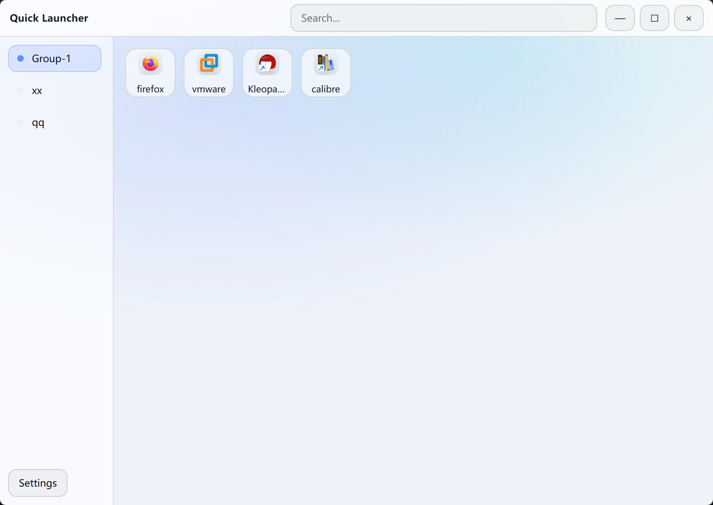

# Quick Launcher

[中文说明](README_CN.md)

A lightweight Windows launcher built with Tauri + Vue 3 + SQLite.

## Features

- Grouped tabs on the left, app cards on the right
- One-click launch, right-click context actions
- Drag & drop to add apps
- Search across all groups
- Settings for layout, fonts, hotkey, and behavior
- Data persisted in SQLite

## Usage

- Click a group on the left to switch apps.
- Right-click on a blank area to add apps or groups.
- Right-click an app card to edit, open folder, or remove.
- Drag files into the window to add apps.
- Double-click a blank area to hide the window (configurable in Settings).

## Shortcuts

- Ctrl/Cmd+F: focus the search bar
- Esc: clear search when the search bar is focused

## Data Storage

- SQLite database: `<app-dir>/data/launcher.db`

## Screenshots




## Development

### UI only

```
pnpm install
pnpm dev
```

### Desktop (Tauri)

```
pnpm install
pnpm tauri dev
```

## Build

Windows is the primary target.

```
pnpm install
pnpm tauri build --no-bundle
```
